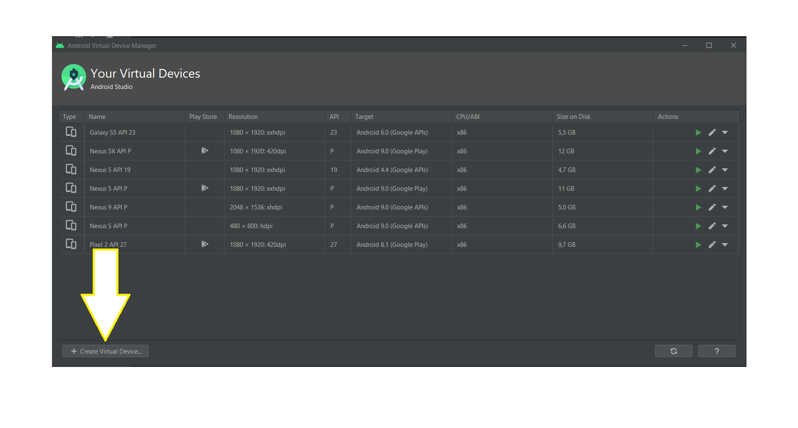

# OpenClassrooms

Ce dépôt contient une mini-application pour le P3 du parcours **Grande École du Numérique**.

### Comment exécuter et compiler l'application ?
  
Il faut au préalable s'assurer de 2 choses :
1. Vérifier la bonne configuration à exécuter

    Si on veut exécuter et compiler **l'application**, il faut alors s'assurer que c'est bien ***app*** qui apparaît.

2. Vérifier qu'un appareil est disponible

    Pour l'exécution de l'application, il faut avoir au moins un appareil dans la liste déroulante, qu'il soit physique (relié par USB) ou émulé.

3. Exécuter l'application

    En appuyant sur le bouton **play**, Android Studio va alors compiler le code et l'exécuter dans l'appareil choisi dans l'étape 2.

4. Ajouter un appareil virtuel

    Si on veut utiliser un émulateur pour exécuter l'application et que la liste des appareils virtuels est vide, il est possible d'ouvrir l'AVD Manager pour ajouter un appareil.  
    Une fois la fenêtre ouverte, il ne reste plus qu'à appuyer sur le bouton en bas à gauche et suivre les étapes pour l'ajout d'un nouvel appareil virtuel.

